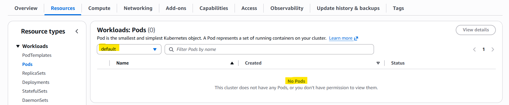
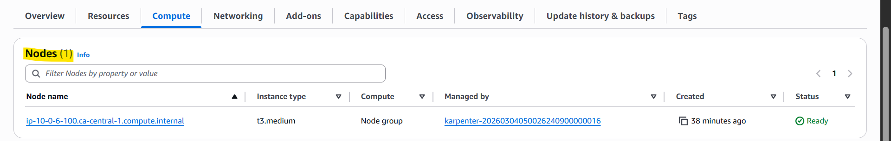
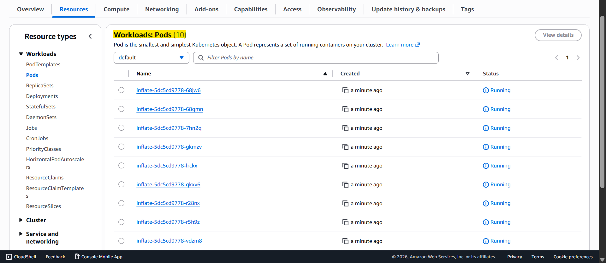
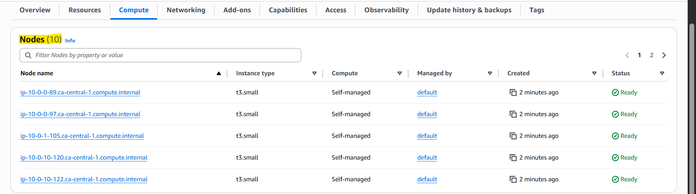

# Terraform Demo: AWS EKS Karpenter

A Terraform demo project of EKS Karpenter

- ref: https://karpenter.sh/docs/

[Set up](./docs/init.md)

## Before Deployment

- 0 pod

- 1 node

---

## After Deployment

- 10 pods

- 10 nodes

